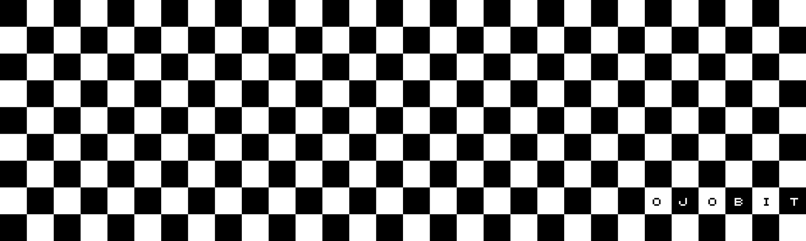

  

<h1 align="center">MCL-UWB</h1>

<strong>The Ultra-Wideband binding — specified, reviewable, and honestly not yet measured.</strong>

  
  
  
  

  <a href="https://github.com/machine-contact-layer/mcl-sdk"><b>Use the SDK instead</b></a> ·
  <a href="https://github.com/machine-contact-layer/mcl-core"><b>Specifications</b></a> ·
  <a href="https://github.com/machine-contact-layer/mcl-link"><b>mcl-link</b></a>

---

> ### Read this before you build on it
>
> This binding is **specified but never run on hardware**. There is no physical
> qualification for UWB in this release, and no conformance evidence behind it.
> It is published so it can be reviewed and implemented, not because it is
> proven. For something measured today, use
> [mcl-ip](https://github.com/machine-contact-layer/mcl-ip) or [mcl-ble](https://github.com/machine-contact-layer/mcl-ble).

## Why this exists

UWB gives something the other bindings cannot: distance that is hard to fake.
That makes it interesting for contact between machines that need to know a peer
is physically near, rather than merely reachable.

The binding is written so that work can start — and so that anyone with the
radios can tell us where the specification is wrong.

UWB is especially relevant when precise ranging or spatially constrained communication is available, but it remains a transport binding rather than the definition of MCL.

## Scope

- MCL Link frame carriage over UWB-capable systems
- capability negotiation
- integration of ranging/spatial measurements as transport metadata
- session/context preservation across handoff
- conformance vectors

## Non-goals

MCL-UWB does not define UWB radio hardware, ranging algorithms, regulatory limits, or MCL semantic meaning.

## Implementation status

The reference implementation is present, freestanding C99, with no allocation
and no global mutable state. It contains **no UWB driver**: how bytes reach the
medium is the integrator's decision. A binding describes a mapping; it does not
become a UWB driver.

Verified: builds under `/W4 /WX`, and the compiled object references no libc
symbol (no `memcpy`, `memset`, `malloc`, or stdio), so it links on a
freestanding target.

- `include/mcl/uwb_binding.h` — public API
- `src/uwb_binding.c` — implementation
- `tests/test_uwb_binding.c` — round trips and the negative cases

**Status: Research Draft.** Nothing here is frozen. Assigned transport id
`0x04` is provisional until Candidate Specification maturity.

## Status

Public research binding. See [`spec/binding-v0.md`](spec/binding-v0.md).

### Evidence

**None.** This binding is unit-tested C99 that has never met UWB hardware. It is
a carriage mapping and an evidence model, not a demonstrated transport.

### Why this binding exposes no distance

UWB is the easiest place in MCL to overclaim, so the API deliberately offers
**no verified-distance field and no proximity-proved flag**.

A ranging measurement is admissible as proximity evidence only when ranging was
actually performed, by a method that cancels clock drift, with authenticated
timestamps, at moderate confidence. There is no relaxed mode. Distance
conversion refuses to overflow rather than wrapping into a small and entirely
plausible distance, which is the worst available failure.

An NLOS measurement stays admissible on purpose: a reflected path is longer than
the direct one, so it can only overstate distance.

None of this defeats a relay. A wormhole forwards valid traffic between two
locations in real time, and no cryptography detects it. Ranging is evidence for
local policy to weigh, never proof of co-presence. See
[`SECURITY.md`](https://github.com/machine-contact-layer/mcl-core/blob/main/SECURITY.md).
